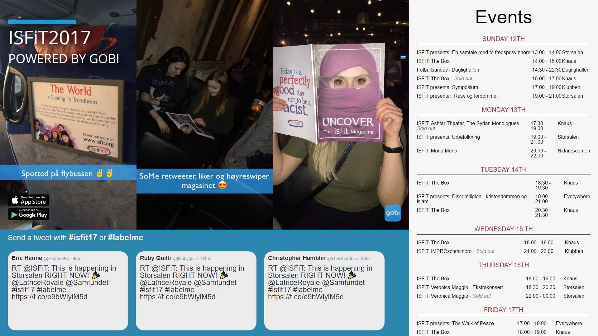

# Live social media for ISFiT 2017

The *International Student Festival in Trondheim* had a webpage displayed on TVs/projectors to show live updates on social media.

It's not too pretty, but was made in less than 12 hours, and on the same day it went live.

The frontend uses [Vue 2](https://github.com/vuejs/vue), and the backend is Node with Express. Websockets from [socket.io](https://github.com/socketio/socket.io) keeps the twitter feed updated.

Run `npm install` inside `./admin`, `./frontend` and `./server` before attempting to use them. 
The output of admin and frontend is supposed to live inside the folder `public` inside `./server`.  
Refer to [deploy.txt](deploy.txt) for more info. (It's actually a `.sh` but you shouldn't run it)